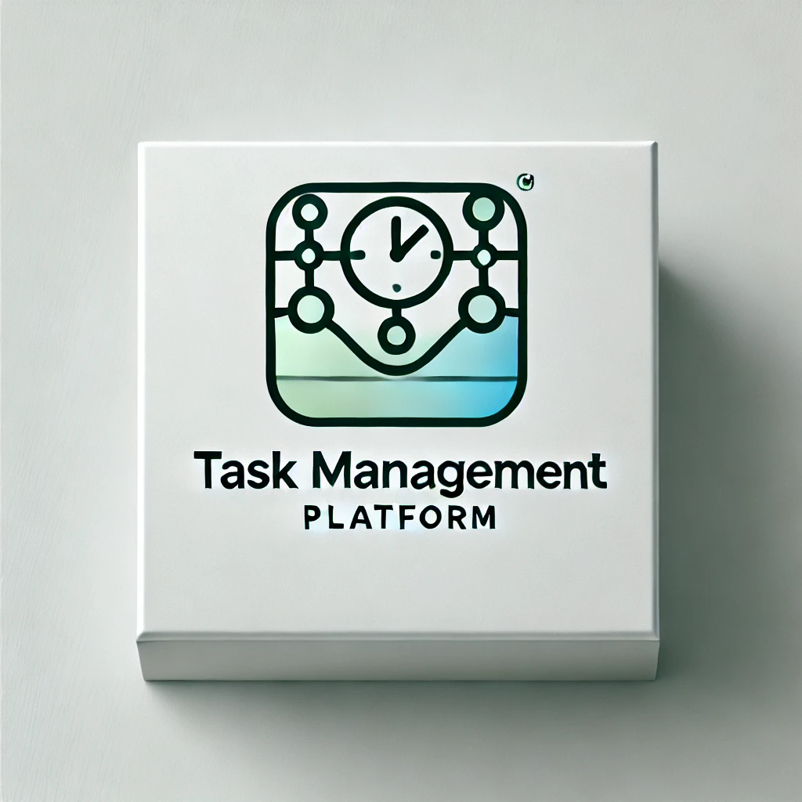

# Task Management Platform

A simple task management platform built using **Angular** for the frontend and **Node.js** with **MongoDB** for the backend. The platform allows users to register, log in, add tasks, manage task duration, and receive news updates based on their interests.



## Features

- **User Authentication**: Users can register, log in, and have their tasks and interests saved.
- **CRUD Operations**: Users can create, read, update, and delete tasks and interests.
- **Task Duration Management**: Tasks have duration tracking and can be marked as complete.
- **Newsfeed Integration**: Display news articles based on user-defined interests.
- **Persistent Data**: User data is stored in MongoDB for persistent use across sessions.

## Tech Stack

- **Frontend**: Angular
- **Backend**: Node.js, Express.js
- **Database**: MongoDB (Atlas)
- **Authentication**: JWT (JSON Web Tokens)

## Getting Started

### Prerequisites

Before you begin, make sure you have the following installed:

- [Node.js](https://nodejs.org/en/)
- [MongoDB Atlas](https://www.mongodb.com/cloud/atlas)
- [Angular CLI](https://angular.io/cli)

### Installation

1. Clone the repository:

   ```bash
   git clone https://github.com/your-username/task-manager-platform.git
   cd task-manager-platform
